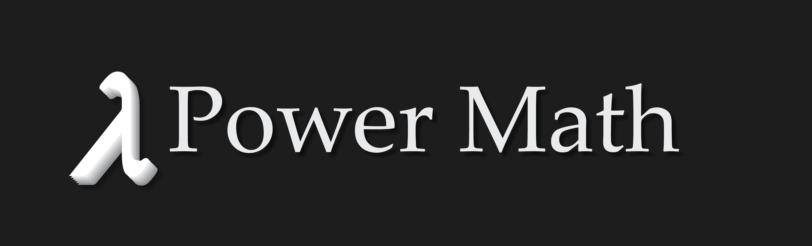

    
     
    
        Built with ❤︎ by <a href="https://github.com/Xevion/">Xevion</a>
    

 

**power-math** is a project dedicated to those who want to practice random math problems from simple arithmetic to geometry, algebra, or trigonometry.

    <h3>
        <a href="https://xevion.github.io/power-math/">Demo</a>
    </h3>

### Features

- Simple, easy to understand interface
- Fun, playful and simple animations, colors and UI feedback.
- 100% client-side - play or as long as you want, offline!
- [ ] Configurable
- [ ] Statistics
- [ ] Lots of problems available

### To-do

- Create help/welcome screen
- Create about screen
- Create configuration screen
    - Adjust question type pool
    - Adjust each question type's difficulty (multiplier)
    - Preview min/avg/max question difficulty by multiplier
- More problem sets
    - Algebra
        - Simplify equation
        - Expand equation
        - Solve equation
        - Solve for variable
    - Trigonometry
        - Radian/degree conversion
        - Sin/Cos/Tan/Csc/Sec/Cot evaluation
        - Inverse trig evaluation
    - Geometry
    - Computer Science
        - Bin/Hex/Oct conversion
    - Trivia?
    - Word Problems
- Create question fadeout/move up animation
- Remember statistics
    - Milestone toasts
        - Customizable milestones, or static?
        - Point based, or # correct based?
    - Viewable track of point earning
        - Points based on problem difficulty, problem type, and speed
        - Line Graph/Bar Graph based view
- Problem difficulty variation
    - Variable multiplier
    - Time limit
        - Progressbar
